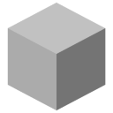
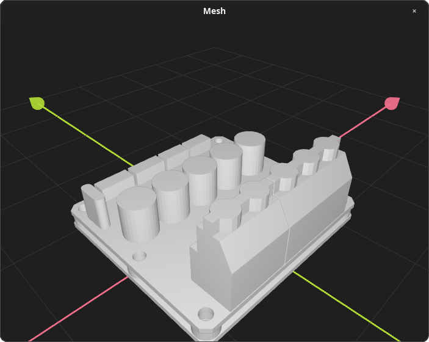
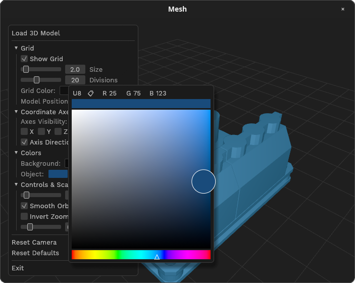

<div align="center">



<font size="6">**Mesh**</font>

**A lightning-fast, lightweight 3D mesh viewer built with Rust.**

[](https://github.com/odevsa/mesh/releases)
[](https://www.rust-lang.org/)

[](#-download--installation)


[Features](#features) •
[Screenshots](#screenshots) •
[Formats](#formats) •
[Installation](#installation) •
[Building](#building) •
[Contributing](#contributing)

<br/>



</div>

## Overview

**Mesh** is an open-source, bloat-free desktop viewer for 3D files. Engineered with performance in mind, it provides immediate startup, silky-smooth navigation, and an uncluttered interface to inspect your 3D models and prints without the overhead of heavy CAD or 3D modeling suites.

## Features

- **Blazing Fast & Lightweight**: Written in pure Rust with a minimal memory footprint and near-instant startup.
- **Multi-Format Support**: Native viewing for `.stl`, `.3mf`, `.obj`, and `.gltf` / `.glb` models.
- **Effortless Navigation**: Orbit camera with smooth momentum damping, customizable zoom speed, and quick-reset view.
- **Highly Customizable**: Real-time tweaks for background color, mesh shading, light angle, and shadow tones.
- **Reference Grid**: Configurable ground grid (size, divisions, position) and directional XYZ axes.
- **Persistent Preferences**: Visual configurations and control settings are automatically saved across sessions.
- **Completely Portable**: Single-binary execution with zero external runtime dependencies required.

## Screenshots

<div align="center">




</div>

## Formats

| Format            |    Extension    | Description                                          |
| :---------------- | :-------------: | :--------------------------------------------------- |
| **STL**           |     `.stl`      | Standard Stereolithography format (Binary and ASCII) |
| **3MF**           |     `.3mf`      | 3D Manufacturing Format used in modern 3D printing   |
| **Wavefront OBJ** |     `.obj`      | Classic 3D geometry format                           |
| **glTF / GLB**    | `.gltf`, `.glb` | GL Transmission Format (standard and binary)         |

## Installation

Mesh is completely portable and requires **no installation**:

Download the latest version for your platform from the **[Releases](https://github.com/odevsa/mesh/releases)** page:

### Linux

Choose your preferred format:

- **AppImage** (universal, recommended):
  ```bash
  chmod +x mesh-*-x86_64.AppImage
  ./mesh-*-x86_64.AppImage
  ```
- **Debian / Ubuntu** (`.deb`):
  ```bash
  sudo dpkg -i mesh_*_amd64.deb
  ```
- **Tarball** (`.tar.xz`): Extract and run the `mesh` binary directly.

### Windows

- Download `mesh-*-x86_64-windows.exe` and double-click to run!

### Mac

- Comming soon

## Usage

### From GUI

Simply launch `Mesh` and **double-click** anywhere or **right-click** and select **"Load 3D Model"**.

| Action                | Shortcut / Gesture                                 |
| :-------------------- | :------------------------------------------------- |
| **Orbit Camera**      | `Left Click` + Drag (with smooth momentum damping) |
| **Zoom In / Out**     | `Mouse Wheel` (speed & direction customizable)     |
| **Context Menu**      | `Right Click` anywhere                             |
| **Open File Dialog**  | `Double Click (LMB)` or select in Context Menu     |
| **Close Menu / Exit** | `Esc`                                              |

### From Command Line

You can pass the path to any supported 3D model directly:

```bash
# Linux and Mac
./mesh /path/to/my_model.stl

# Windows
mesh.exe C:\models\sample.3mf
```

## Building

### Prerequisites

- latest stable Rust toolchain

### Compilation

```bash
# 1. Clone the repository
git clone https://github.com/odevsa/mesh.git
cd mesh

# 2. Build in release mode
cargo build --release

# 3. Run the compiled binary
./target/release/mesh [model-path]
```

## Contributing

Contributions, bug reports, and suggestions are welcome!

1. Fork the repository
2. Create your feature branch (`git checkout -b feature/amazing-feature`)
3. Commit your changes (`git commit -m 'feat: Add amazing feature'`)
4. Push to the branch (`git push origin feature/amazing-feature`)
5. Open a Pull Request

Feel free to open an [Issue](https://github.com/odevsa/mesh/issues) if you find a bug or have an idea for a new feature.
