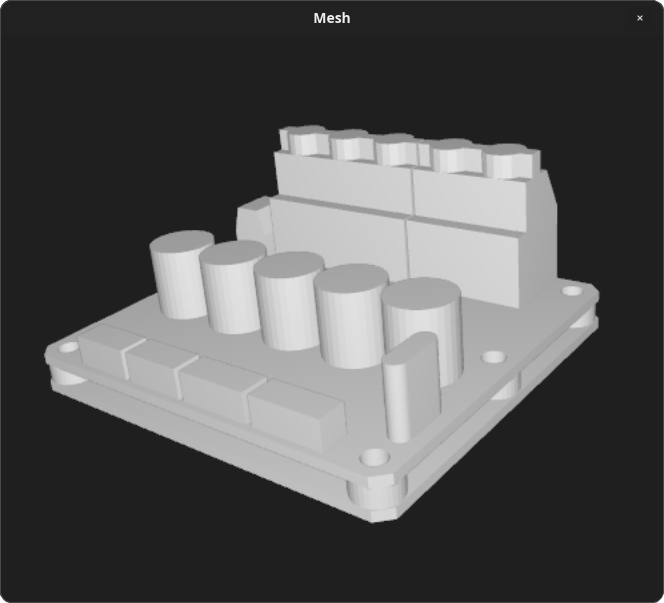

# Mesh

A lightweight desktop application to view 3D mesh files written in rust.

<p align="center">
  
</p>

## Supported formats

- STL
- 3MF
- OBJ
- glTF (gltf/glb)

## Installation

Mesh is portable and requires no installation, simply download the executable and run:

1. Head over to the [Releases](https://github.com/odevsa/mesh/releases) page.
2. Download the binary for your operating system:
   - **Windows**: Download the `.exe` file and run it directly.
   - **Linux**: Download the `.AppImage` file, grant execute permissions (`chmod +x <file>.AppImage`), and run it.

## Building

1. Build:

   ```bash
   cargo build --release
   ```

2. Run with a file:

   ```bash
   ./target/release/mesh /path/to/model.stl
   ```
